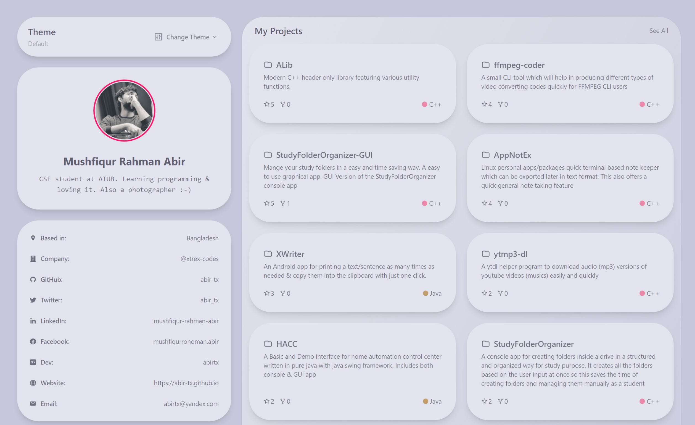

<h1 align="center">Abir's GitProfile</h1>

<a href="https://abir-tx.github.io">Mushfiqur Rahman Abir's Public Portfolio</a> implementation Using <a href="https://github.com/arifszn/gitprofile">GitProfile</a> Project

## Disclaimer

This is a **fork** and **my modified** version of [GitProfile](https://github.com/arifszn/gitprofile) project. The repo is used for my public web portfolio. So it will be modified with some more features and customization.

> Thank you @arifszn brother for this cool project �

The full & upstream documentaion can be found [here](https://github.com/arifszn/gitprofile/blob/main/README.md)

### Setting up GitHub Pages Deployment

  - Set your **GitHub pages** source to ***gh-pages*** branch.
  - Edit the `vite.config.js` file's `base` property according to your needs. If you are deploying to `https://<USERNAME>.github.io`, set base to `'/'`. If you are deploying to `https://<USERNAME>.github.io/<REPO>/`, then set base to `'/<REPO>/'`.

## 📄 License

**GitProfile** is licensed under the [Apache-2.0 License](https://github.com/arifszn/gitprofile/blob/main/LICENSE).
